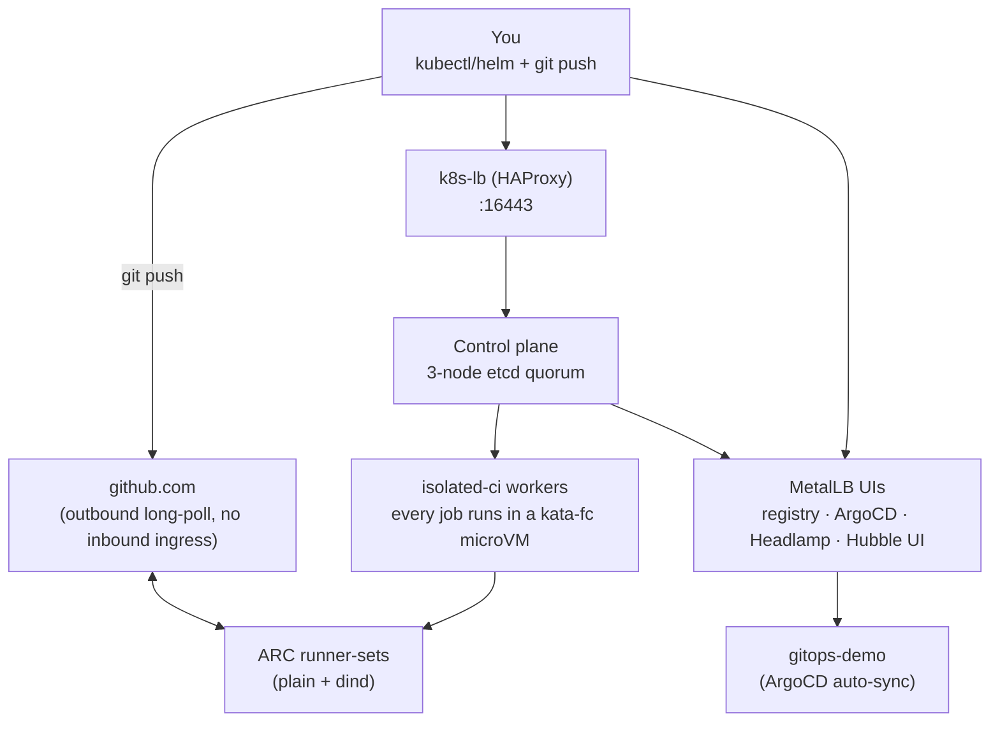

# Bare-metal k8s cluster

A real `kubeadm` Kubernetes cluster running on nested libvirt/KVM VMs on
this host — not `kind`, not a managed cloud cluster. This is the final,
currently-running infrastructure that the learning roadmap in
[`exercises/`](exercises/README.md) built up incrementally and now runs
on top of: Actions Runner Controller CI, Kata Containers microVMs, and
GitOps via ArgoCD all target this cluster.

For the story of how it got here — the step-by-step roadmap, the
findings, the benchmarks, the disaster drills — see
[`exercises/README.md`](exercises/README.md). This file is about the
cluster itself: what's running, how to operate it, how to rebuild it.

## Topology

| Node | Role | IP | vCPU/RAM |
|---|---|---|---|
| `ci-cp1` | control-plane | `192.168.122.140` | 2 / 4GB |
| `ci-cp2` | control-plane | `192.168.122.74` | 2 / 4GB |
| `ci-cp3` | control-plane | `192.168.122.126` | 2 / 4GB |
| `ci-worker1` | worker (`node-role=isolated-ci`) | `192.168.122.102` | 2 / 3GB |
| `ci-worker2` | worker (`node-role=isolated-ci`) | `192.168.122.109` | 2 / 3GB |

3-node etcd quorum (genuine HA, not a single control-plane node — see
[Project 5](docs/exercises/05-disaster-exercises.md)), fronted by an
HAProxy load balancer (`k8s-lb` Docker container on this host,
`:16443` → round-robin across all 3 API servers,
[`config`](exercises/05-disaster-exercises/haproxy.cfg)). VM disk
images live in `vm-images/` (`.gitignore`d — large binary runtime
state, not source). IPs are static via libvirt DHCP host reservations
(`virsh net-edit default`) — API server addresses and TLS certs are
pinned to these, so a stale DHCP lease will break the cluster after a
host reboot.

## Architecture



Every arrow above is a real, currently-live path: pushes to this
repo's `main` branch reach ArgoCD via its own poll of GitHub, GitHub
Actions jobs reach ARC's listener via an outbound long-poll (no
inbound ingress exists on this cluster at all), and every CI job pod
now runs under `kata-fc` microVM isolation rather than plain `runc` —
see [What's installed](#whats-installed) below for the full detail
behind each box.

## Isolation approach for a CI system

**The recommended approach: run untrusted CI jobs inside a microVM, with
a normal container runtime running *inside* that microVM** — not plain
containers alone, and not a microVM without a container runtime layer
on top. This is exactly what this cluster already does (ARC runner
pods → `kata-fc` → Firecracker → `containerd-shim-kata-v2` inside the
guest), not a hypothetical.

**Why not containers alone**: [Emir Bosnak's *Why MicroVMs Are Eating
the Cloud in 2026*](https://emirb.github.io/blog/microvm-2026/) makes
the core argument plainly — "containers are not a security boundary,
they are a mechanism to control resource usage," citing 8 documented
container-escape CVEs in 18 months. Namespaces/cgroups/seccomp share
one host kernel; a single kernel bug breaks every tenant on that host
at once. A CI system that runs arbitrary, untrusted `.github/workflows`
YAML from anyone with push/PR access is exactly the threat model this
matters for — confirmed concretely in this project's own [security
drill](docs/exercises/06-github-actions-arc-security-drill.md), where a
CI job's own container-level isolation held up under every probe, but
the drill's whole premise (probing for host escape) only makes sense
because container isolation is a "mostly holds" boundary, not a "can't
be broken" one.

**Why a container runtime on top of the microVM, not a bare VM**: the
article calls this the "Matryoshka model" — each layer trusts only the
layer below it (hardened host → KVM → minimal Rust VMM → guest kernel →
container runtime → the untrusted job), and a breach at any one layer
doesn't compromise the others. This is what actually gives a CI system
back the developer ergonomics of "just run this container image" while
keeping the hardware-enforced VM boundary as the actual security
guarantee — which is exactly Kata Containers' own architecture, not a
novel idea we're proposing on top of it.

**Where our own measurements disagree with the article, and why that
matters**: the article reports ~125ms Firecracker boot times and
"single-digit percent" CPU overhead. Project 4's own measured `kata-fc`
cold start (pod creation → `Ready`, 5-run average, on this exact
cluster) is **~3.17s** — over 25x slower. This isn't a contradiction so
much as a reminder to measure your own stack rather than trust a
published number: the article's number is Firecracker's own boot time
in isolation; ours is the *full* path through Kata's shim, containerd's
CRI, CNI setup, and kubelet scheduling on top of that boot — the
overhead the article is implicitly not counting. **The lesson for
choosing a CI isolation approach**: don't adopt a technology on the
strength of a benchmark number alone — reproduce it in your own stack,
because the orchestration layers wrapped around the microVM usually
cost more than the microVM itself.

**The honest tradeoff, matching what we found**: the article's own
conclusion — "the old 'VMs are too slow' argument stopped being
persuasive years ago... the real cost is operational, not
performance" — matches this project's experience exactly. The
isolation itself works and (once `kata-fc`'s two real EmptyDir/devmapper
gaps were fixed) is genuinely cheap on the dimensions that matter most
for CI (disk I/O, memory, once the right hypervisor is chosen). The
actual cost has been operational: a devmapper thin-pool that doesn't
survive a reboot, an `emptydir_mode` default that silently picks the
wrong storage backend for Firecracker, a chart that can't set resource
limits on an auto-generated sidecar container, real OOM incidents under
concurrent load. None of these are performance problems — they're the
"someone has to actually run this" tax the article names directly.

**Practical recommendation for picking a hypervisor under Kata,
specific to CI**: the article's Firecracker-vs-Cloud-Hypervisor
framing (minimalism vs. broader device/passthrough support) matches
what Project 4 measured directly — `kata-fc` wins decisively on disk
I/O and memory once its two setup gaps are fixed, `kata-qemu` is the
safer default only when a workload genuinely needs something
Firecracker's minimal device model can't provide (this project never
hit that need). Reserve `kata-qemu`/Cloud-Hypervisor-class hypervisors
for jobs with real device/passthrough requirements; default to
Firecracker-class minimalism for everything else, matching the
article's own recommendation.

### DIY (this project) vs. a managed offering — [SlicerVM](https://slicervm.com/)

Worth naming a concrete alternative to everything above: SlicerVM
(Alex Ellis / OpenFaaS Ltd) is a real, commercial, self-hosted
microVM-management daemon built on the *same* underlying isolation
boundary this cluster uses — Firecracker on Linux/KVM (falling back to
QEMU for GPU/NIC passthrough, or Apple's Virtualization Framework on
macOS) — exposed via a REST API/CLI/SDK instead of raw `jailer`
configs and containerd shims. It explicitly targets CI/CD runners and
AI-agent sandboxing as use cases.

**Same core security guarantee, different layer.** The hardware
isolation boundary is identical to `kata-fc` here — a Firecracker
microVM either way. The difference is entirely in what wraps around
it:

| | This cluster (Kata + `kata-fc`) | SlicerVM |
|---|---|---|
| Isolation boundary | Firecracker microVM | Firecracker microVM (same) |
| Orchestration | Kubernetes `RuntimeClass` — any pod opts in with one line | Standalone daemon + REST API/CLI/SDK |
| Boot path | Kata shim → containerd CRI → CNI → kubelet (~3.17s measured) | ZFS-snapshot-based, sub-second claimed |
| Platform | Linux/KVM only | Linux/KVM + macOS (Apple Virtualization Framework) |
| Guest image | Minimal, container-optimized rootfs | Full systemd + package manager Linux VM |
| Ecosystem | Full Kubernetes: RBAC, NetworkPolicy, ArgoCD, Headlamp, autoscaling all already apply | None of that — you'd integrate it around/instead of k8s yourself |
| Cost | Free (Kata + Firecracker, both Apache 2.0) — the operational cost was ours to pay | ~$25–250/month + EULA |
| Who found/fixed the rough edges | Us, this session (devmapper survival, `emptydir_mode`, the ARC chart's resource-override bug, a real OOM incident) | Vendor's problem |

**The honest tradeoff**: SlicerVM is buying back exactly the
"operational cost, not performance" tax the article calls out — someone
else has already solved snapshot management, cross-platform tooling,
and image builds, in exchange for money and a EULA. We paid that cost
ourselves and came out with something fully understood and free, but
Kubernetes-native and Linux-only. For a team that wants Firecracker
isolation *without* wanting to become Kata/containerd experts,
SlicerVM is a reasonable buy. For a Kubernetes-native CI system where
the isolation should just be another `RuntimeClass` a pod spec opts
into — which is the actual architecture this whole cluster is built
around — what's already running here is the more integrated answer,
not a worse one.

### A closer competitor: [Actuated](https://actuated.com/)

Same company as SlicerVM (Alex Ellis / OpenFaaS Ltd), but a much more
direct comparison to this project specifically — Actuated is a hosted
control plane purpose-built for **CI runners**, not a general-purpose
"boot any microVM" tool. You supply the hardware (bare-metal or
nested-virt-capable cloud VMs); Actuated's SaaS control plane
schedules single-tenant, immutable-filesystem Firecracker microVMs
onto it per job, and integrates directly with GitHub Actions/GitLab
CI/Jenkins as the job-dispatch layer.

**Mapped onto this cluster's own two layers:**

| Layer | This cluster | Actuated |
|---|---|---|
| Job dispatch / GitHub integration | ARC (`gha-runner-scale-set`) — GitHub App auth, listener long-polls GitHub, free/OSS | Actuated's own control plane — same job, proprietary + subscription |
| Per-job isolation | `kata-fc` — Firecracker microVM via Kata's Kubernetes `RuntimeClass` | Firecracker microVM, same primitive, no Kubernetes involved |
| Where it runs | Our own 5-node kubeadm cluster, fully Kubernetes-integrated | Hardware you provide; their control plane, not yours |
| Cost | Free (Apache 2.0 all the way down) | No free tier; starts ~$250/month for 5 concurrent jobs |

**The honest read**: Actuated is essentially "ARC + Kata-fc, as a
hosted product" — closer to a direct competitor of *this whole
project* than SlicerVM was, rather than just a competitor to the
isolation layer underneath it. The isolation guarantee is the same
Firecracker boundary either way; what you're actually paying for is
someone else having already built and maintained the GitHub-integration
plumbing, VM image lifecycle, and scaling logic we built ourselves in
ARC + `kata-fc` — at the cost of losing the rest of the Kubernetes
ecosystem (RBAC, NetworkPolicy, ArgoCD, Headlamp, `kubectl` itself)
that comes free with doing it inside a real cluster instead of a
CI-only control plane.

## What's installed

- **CNI**: Cilium (eBPF datapath, `kube-proxy` still in place alongside
  it), Hubble + Hubble UI for flow observability.
- **LoadBalancer**: MetalLB, L2 mode.
- **Storage**: `rancher/local-path-provisioner` (dynamic `StorageClass`),
  plus a plain `registry:2` internal container registry
  (`192.168.122.200:5000`, insecure/plain-HTTP), backed by a 10Gi
  `local-path` PVC — not `emptyDir` (previously lost its data at least
  3 separate times across this project's history; verified surviving a
  real pod deletion after the fix).
- **Metrics**: `metrics-server`, `--kubelet-insecure-tls` (stock
  kubeadm's self-signed kubelet serving certs have no IP SANs — the
  correct fix, `serverTLSBootstrap` + a CSR auto-approver, is real
  surgery on an already-running cluster not worth it for this lab).
  `kubectl top` and Headlamp's CPU/memory tiles both work now.
- **GitOps**: ArgoCD, auto-syncing [`cluster/gitops-demo/`](cluster/gitops-demo/)
  from this repo's `main` branch (`automated: {prune: true, selfHeal:
  true}` — pushes here take effect on the cluster automatically).
- **CI**: GitHub Actions Runner Controller, two runner-scale-set
  releases side by side — `arc-runner-set` (plain containerMode,
  `runner`: 500m/1Gi) and `arc-runner-set-dind` (dind mode, `runner`:
  500m/512Mi + a namespace-wide `LimitRange` covering the chart's
  auto-generated `dind`/`init-dind-externals` containers at 500m/1Gi
  each) — both ephemeral, scale-to-zero (`minRunners: 0`) on
  `isolated-ci` nodes. Auth via a narrowly-scoped GitHub App. Real
  memory requests on every container as of a load test that OOM'd a
  worker under concurrent load — see the gotchas below.
- **Isolation**: Kata Containers (`kata-deploy`), `kata-qemu` and
  `kata-fc` (Firecracker) RuntimeClasses available and benchmarked.
  **Both ARC runner-scale-sets run their pods under `kata-fc`** —
  every real CI job gets microVM isolation, not just benchmark pods.
- **TLS/webhooks**: cert-manager (a dependency of the ARC controller's
  own internal webhook, unrelated to GitHub webhooks).
- **NetworkPolicy coverage**: `registry`, `headlamp`, and kube-system's
  5 pod-network workloads (`coredns`, `metrics-server`, `hubble-relay`,
  `hubble-ui`, `kata-deploy`) now have default-deny + explicit allow
  policies — previously zero coverage anywhere outside `arc-runners`
  and ArgoCD's own pods. Every `kube-apiserver`/ClusterIP/node-IP
  egress rule needed a `CiliumNetworkPolicy` with `toEntities`
  (`kube-apiserver`, `host`, `remote-node`) rather than a plain
  `NetworkPolicy` port rule — see the gotchas below.
- **Monitoring/alerting/logging**: fully self-hosted OSS —
  `kube-prometheus-stack` (Prometheus + Grafana + Alertmanager +
  `kube-state-metrics` + `node-exporter`) for metrics/dashboards/alerts,
  plus `loki` + `grafana/alloy` for log aggregation (the ephemeral-
  ARC-runner-pod-logs-vanish gap flagged earlier). All cluster-infra
  components steered onto the control-plane nodes (4GB RAM each) via
  taints/tolerations rather than the already-tight `isolated-ci`
  workers (2.8GB each, the site of the earlier real OOM incident) —
  only `node-exporter` and `alloy` run as DaemonSets across every node,
  since both genuinely need to. `kubeScheduler`/`kubeControllerManager`/
  `kubeEtcd` ServiceMonitors are deliberately disabled — all three
  confirmed unreachable on this kubeadm cluster (scheduler/
  controller-manager bind `127.0.0.1` by default; etcd's own scrape
  target came up `up=0` after a real install, cause not yet
  root-caused). See
  [`docs/monitoring-alerts.md`](docs/monitoring-alerts.md) for the
  setup detail and specific alert conditions targeting this project's
  own real incidents (worker OOM, ARC/ArgoCD control-plane pods going
  down, node `NotReady`).

## UIs

Three web UIs, all reachable directly from this host via MetalLB
LoadBalancer IPs — no port-forwarding needed.

### ArgoCD

- **URL**: `https://192.168.122.201`
- **Login**: `admin` / `kubectl -n argocd get secret
  argocd-initial-admin-secret -o jsonpath='{.data.password}' | base64 -d`
- GitOps state — shows the `gitops-demo` Application's live sync/health
  status and resource tree.


### Headlamp

- **URL**: `http://192.168.122.202`
- **Login**: ServiceAccount token, `cluster-admin`-scoped —
  `kubectl create token headlamp -n headlamp`
- General Kubernetes dashboard (pods, deployments, logs, resource
  usage, live editing) — the actively maintained sig-ui successor to
  the now-archived Kubernetes Dashboard project.


### Hubble UI

- **URL**: `http://192.168.122.203`
- **Login**: none
- Cilium's network-flow observability UI — pick a namespace from the
  dropdown to see live, real packet flows between pods, Services, and
  the outside world (`world`), with verdicts (forwarded/dropped) and
  L7 info where available.


### Grafana

- **URL**: `http://192.168.122.204`
- **Login**: `admin` / `kubectl get secret -n monitoring
  kube-prometheus-stack-grafana -o jsonpath='{.data.admin-password}' |
  base64 -d` (currently the placeholder value set in
  `cluster/kube-prometheus-stack-values.yaml` — change this before any
  real use).
- Metrics dashboards (Prometheus, auto-configured data source) and log
  exploration (Loki, add as a data source at
  `http://loki.monitoring.svc.cluster.local:3100`) — the OSS
  monitoring/alerting/logging stack described above.

*(Screenshot pending — this UI was just stood up and not yet
captured.)*

## Operating the cluster

```bash
# start/stop all 5 VMs
sg libvirt -c "virsh start ci-cp1 ci-cp2 ci-cp3 ci-worker1 ci-worker2"
sg libvirt -c "virsh shutdown ci-cp1 ci-cp2 ci-cp3 ci-worker1 ci-worker2"

# kubectl/helm access
export KUBECONFIG=cluster/.kube/config   # fetched from a control-plane VM's /etc/kubernetes/admin.conf

# recreate the HAProxy load balancer if its container was removed
docker run -d --name k8s-lb --network host --restart unless-stopped \
  -v "$(pwd)/exercises/05-disaster-exercises/haproxy.cfg:/usr/local/etc/haproxy/haproxy.cfg:ro" \
  haproxy:2.9
```

Known gotchas, both real and previously hit:
- **Devicemapper thin-pool for `kata-fc` does not survive a VM
  reboot** (loopback + `dmsetup` state is ephemeral) — recreate from
  the still-intact `/var/lib/containerd/devmapper/{data,meta}` files on
  each worker, then `systemctl restart containerd`. See
  [`docs/exercises/04-kata-microvms.md`](docs/exercises/04-kata-microvms.md).
- **DiskPressure on the `isolated-ci` workers** was a recurring problem
  until the VM disks were grown 20GB→40GB (live `virsh blockresize` +
  `growpart`/`resize2fs`, no downtime needed). See
  [`docs/exercises/05-disaster-exercises.md`](docs/exercises/05-disaster-exercises.md).
- **A GitHub repo rename breaks ARC silently** — `githubConfigUrl` in
  the runner-scale-set Helm values has to match the repo's current
  name exactly, or every runner registration 404s and the listener pod
  crash-loops indefinitely with no scheduling failure surfaced
  anywhere else.
- **`kata-fc`'s `EmptyDir` volumes default to a tiny (~400MB) RAM-backed
  guest tmpfs, not real disk** — Firecracker has no virtio-fs support,
  so Kata's default `emptydir_mode="shared-fs"` silently falls back
  instead of erroring. Any pod with real `EmptyDir` needs (e.g. ARC's
  `dind` containerMode) fails with `No space left on device`. Fix:
  `emptydir_mode="block-plain"` in `configuration-fc.toml` on each
  worker, plus a pod-level `securityContext.fsGroup` matching the
  container's UID (the fresh block device mounts root-only otherwise).
  See [`docs/exercises/04-kata-microvms.md`](docs/exercises/04-kata-microvms.md).
- **ARC's listener pod can hang silently on a transient network
  blip** — no crash, no restart, `1/1 Ready` throughout, but it stops
  polling GitHub for jobs entirely, so every dispatched job sits
  `queued` forever. The container ships with no
  liveness/readiness probe at all. Fix: `kubectl delete pod` on the
  listener (its Deployment recreates it immediately). See
  [`docs/exercises/06-github-actions-arc.md`](docs/exercises/06-github-actions-arc.md).
- **Any NetworkPolicy egress rule aimed at a ClusterIP or a real node
  IP needs `CiliumNetworkPolicy` + `toEntities`, not a plain
  `NetworkPolicy` port rule** — confirmed the hard way four separate
  times while sweeping NetworkPolicy coverage across the cluster: (1)
  `kube-apiserver` access (`10.96.0.1:443`) is DNAT'd before standard
  port-matching runs, so a `namespaceSelector`/port rule silently
  matches nothing; (2) kubelet-scrape traffic to real node IPs
  (`metrics-server` → `:10250`) is classified by Cilium's identity
  model as in-cluster and isn't matched by a plain `ipBlock:
  0.0.0.0/0` either — needs `toEntities: [host, remote-node]`; (3)
  **CoreDNS's own upstream-forwarder egress is easy to forget
  entirely** — a `namespaceSelector: {}` DNS-egress rule only covers
  in-cluster queries, breaking *all* external-name resolution
  cluster-wide (`api.github.com`, etc.) the moment it's applied,
  surfaced as `ARC` failing to reach `api.github.com` with `server
  misbehaving`; (4) **`hubble-ui`'s backend needs `kube-apiserver`
  egress too**, missed on the first sweep entirely — its backend lists
  Namespaces directly to populate its own cluster/namespace picker, so
  without this the UI loads fine but the picker stays empty, with the
  actual cause (`failed to list *v1.Namespace: ... dial tcp
  10.96.0.1:443: i/o timeout`) visible only in the backend container's
  own logs, not surfaced anywhere in the UI itself. A stale Cilium
  policy revision on the already-running pods also meant the eventual
  correct fix needed a `kubectl rollout restart deployment
  coredns`/`hubble-ui` to actually take effect — re-applying the YAML
  alone wasn't enough, both times this came up.
- **A real concurrent CI load test genuinely OOM'd a worker node** —
  dispatched 20 workflow runs across all 4 workflows at once (both ARC
  scale-sets scaling to their `maxRunners: 3` cap, 6 concurrent
  `kata-fc` pods). Root cause: **every runner pod had zero memory
  requests/limits**, so the scheduler had no way to know 3 concurrent
  microVMs (each demanding real host RSS once a job actually runs, not
  just their ~200MB idle footprint) wouldn't fit on a 2.8GB
  `isolated-ci` worker — it kept stacking them until the node's kernel
  itself started thrashing (`load average: 114.56` *inside* the
  2-vCPU guest, `free -h` showing 83MB available out of 2.8GB, zero
  swap configured at all). The node went genuinely unresponsive —
  `NotReady`, SSH timing out, even the QEMU guest agent disappearing
  on the worse-hit node — and needed a hard `virsh reset`, after which
  containerd's devmapper thin-pool (ephemeral state, per the gotcha
  above) needed manually recreating again before kubelet would start.
  **Fixed at the root**: added real `resources.requests`/`limits` to
  every runner container (`arc-runner-set`'s `runner`: 500m/1Gi;
  `arc-runner-set-dind`'s `runner`: 500m/512Mi) plus a namespace-wide
  `LimitRange` in `arc-runners` (500m/1Gi default) covering the dind
  scale-set's auto-generated `dind`/`init-dind-externals` containers —
  which **cannot** receive `resources` via the chart's own
  `values.yaml` at all (confirmed: `gha-runner-scale-set` 0.14.2 only
  field-merges overrides for the `runner` container; any
  `dind`-named entry in `template.spec.containers`/`initContainers` is
  appended as a raw duplicate instead of merging, failing
  server-side-apply with `duplicate entries for key [name="dind"]` —
  a real, currently-open upstream bug/PR,
  `actions/actions-runner-controller#4567`). Re-ran the exact same
  20-dispatch wave afterward: jobs correctly queued/drained (never
  more than 2 running at once per node) instead of stacking, all 5
  nodes stayed `Ready` throughout, host load stayed under 5 instead of
  spiking past 11. See
  [`cluster/arc-runners-limitrange.yaml`](cluster/arc-runners-limitrange.yaml).

## Rebuilding from scratch

```bash
cluster/scripts/provision-vms.sh ci-cp1 ci-cp2 ci-cp3 ci-worker1 ci-worker2
cluster/scripts/install-k8s-prereqs.sh   # containerd + kubeadm/kubelet/kubectl, run over SSH
# kubeadm init / kubeadm join, then:
cluster/scripts/configure-insecure-registry.sh 192.168.122.200:5000
cluster/scripts/etcd-snapshot.sh 192.168.122.140   # periodic backup, see docs/exercises/05-disaster-exercises.md
```

Full step-by-step provisioning detail (cloud-init, kubeadm preflight
gaps, Cilium/MetalLB install, HA retrofit) is in
[`docs/exercises/03-bare-metal-simulation.md`](docs/exercises/03-bare-metal-simulation.md)
and [`docs/exercises/05-disaster-exercises.md`](docs/exercises/05-disaster-exercises.md).

## Docs

- [`exercises/README.md`](exercises/README.md) — the full learning
  roadmap this cluster grew out of, exercise by exercise.
- [`docs/concepts.md`](docs/concepts.md) — checkpoint questions
  (isolation boundaries, packet paths, VM-vs-container security).
- [`docs/decisions.md`](docs/decisions.md) — lightweight ADRs for every
  non-obvious call made along the way.
- [`docs/exercises/`](docs/exercises/) — full per-project write-ups:
  findings, benchmarks, evidence.
